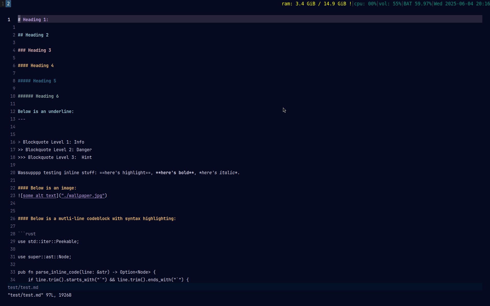
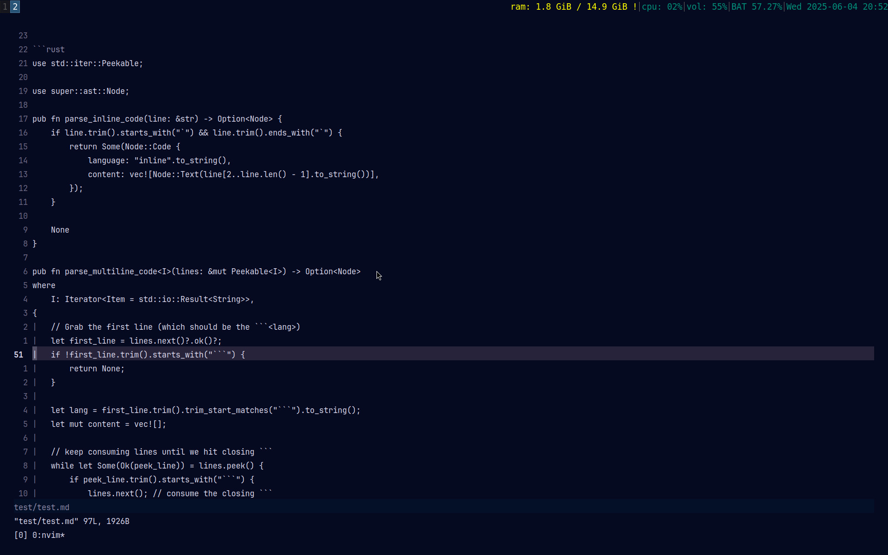
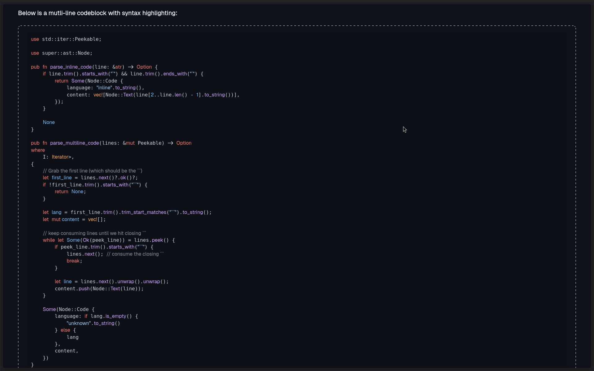
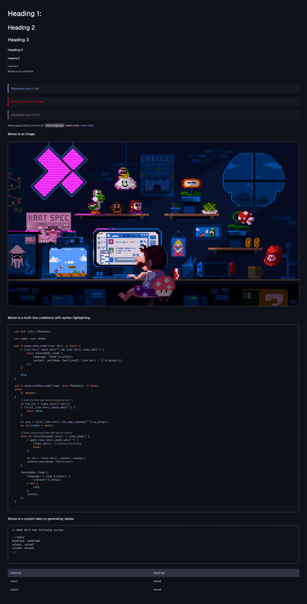

# 🦀 rust_down

A Markdown processor built to learn rust; ( and markdown needed some flavour anyway )

## ✨ Features

- Headings (`#` to `######`)
- inline **Bold** and *Italic* support ==Highlight==
- Blockquotes with variants:
  - `>` → info block (blue)
  - `>>` → danger block (red)
  - `>>>` → hint block (green)
- Language Specific Syntax highlighting for code blocks 
- Images and horizontal rules 
- A custom table syntax (because standard Markdown tables suck):
```

:::table
heading1, heading2
value1, value2
value3, value4
:::

```

---

## 🚀 Usage

You can run it in two ways:

### With Cargo:
```bash
cargo run -- <path_to_markdown> <path_to_stylesheet>
```

### Or, just run the binary:
```bash
./rust_down <path_to_markdown> <path_to_stylesheet>
```









